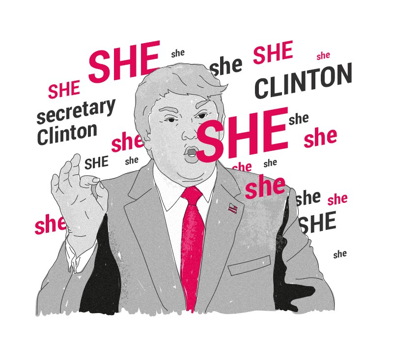
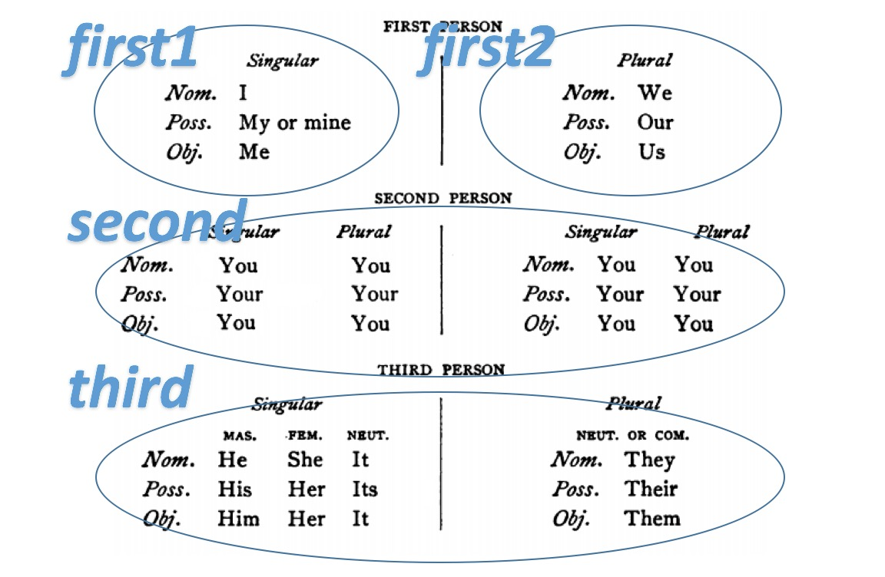

---
output:
  html_notebook: default
  html_document: default
  pdf_document: default
---
<div id="header">
<h1 class="title"><b><font face="Times New Roman">The use of personal pronoun in Inaugural Speeches</font></b></h1>
<h4 class="author"><em><font face="Times New Roman">Yitong Hu</font></em></h4>
<h4 class="date"><em><font face="Times New Roman">February 3rd. 2017</font></em></h4>
</div>
<div style="text-align:center"></div>

<h3><font face="Times New Roman">Part 0 - Topic introduction</font></h3>
<p>People always use a lot of personal pronouns to avoid repeating someone’s names time and time again. Different people may use different personal pronouns for different weight in different situation to demonstrate different meanings and emotions. What about the situations in presidents' Inaugural Speeches?</p>


<h3><font face="Times New Roman">Part 1 - Packages preparaion</font></h3>

```{r,message=F,warning=F}
packages.used=c("RColorBrewer","qdap","ggplot2","reshape2","syuzhet","tm","qdap","reshape2","gridExtra","ggplot2","wordcloud","dplyr","tidytext")

# check packages that need to be installed.
packages.needed=setdiff(packages.used, 
                        intersect(installed.packages()[,1], 
                                  packages.used))
# install additional packages
if(length(packages.needed)>0){
  install.packages(packages.needed, dependencies = TRUE)
}
require(devtools,quietly = T)
install_github('recharts', 'taiyun')

# library packages
library("RColorBrewer",quietly = T)
library("qdap",quietly = T)
library("ggplot2",quietly = T)
library("reshape2",quietly = T)
library("syuzhet",quietly = T)
library("tm",quietly = T)
library("qdap",quietly = T)
library("reshape2",quietly = T)
library("gridExtra",quietly = T)
library("ggplot2",quietly = T)
library("wordcloud",quietly = T)
library("dplyr",quietly = T)
library("tidytext",quietly = T)
library("recharts",quietly = T)

#part of codes are in this R file.
source("../lib/customized_function.R")
```


<h3><font face="Times New Roman">Part 2 - Data cleaning</font></h3>

<p>We count the word frequency for each speeches and make this data matrix on which our whole analysis would based.</p>

```{r,warning=F}
inaug.list=read.csv("../data/InaugurationInfo.csv", stringsAsFactors = FALSE)
inaug.data=read.table("../data/InauguationDates.txt", stringsAsFactors = FALSE,blank.lines.skip=F,sep= "\t")
mat1<-NULL

for(i in seq(nrow(inaug.list))) {
filename <- paste0("../data/InauguralSpeeches/inaug", 
                     inaug.list$File[i], "-", 
                     inaug.list$Term[i], ".txt")
tx <- readLines(filename,warn=F)
if (i==58) 
{
  tx<-paste(tx, collapse = " ")
  tx_words <- strsplit(tx, split = " ")[[1]]
}
else
tx_words <- strsplit(tx, split = " ")[[1]]
date_pattern2 <- "[a-zA-z]+"
tx_words2 <- grep(tx_words, pattern = date_pattern2, value=T)
tx_log <- grepl(tx_words2, pattern = date_pattern2)
matches <- gregexpr(pattern = date_pattern2, text = tx_words2[tx_log])
tx_words <- unlist(regmatches(tx_words2[tx_log], matches))
tx_words <- unlist(rm_stopwords(tx_words))
mat<-NULL
table<-table(tx_words)
word<-names(table)
n<-unname(table)
matname<-paste(inaug.list$File[i],inaug.list$Term[i])
mat<-cbind(rep(matname,nrow(n)),word,n)
mat1<-rbind(mat1,mat)
}
colnames(mat1)<-c("name","word","n") 
matsort<-mat1[order(as.numeric(mat1[,3]),decreasing = T),]
head(matsort)
```

<h3><font face="Times New Roman">Part 3 - Different president uses personal pronoun for different weight</font></h3>

<p>We divide personal pronouns into 4 types,first person singular form,first person plural form,second person form and third person form.</p>

<div style="text-align:center"></div>

```{r,warning=F}
#personal pronoun

first1<-c("I","me","mine","my")
first2<-c("we","our","ours","us")
second<-c("you","your","yours")
third<-c("he","she","it","him","her","his","hers","they","them","their")
personal<-list(first1,first2,second,third)

pp_mat<-matrix(nrow = nrow(inaug.list),ncol = 4)
for(i in seq(nrow(inaug.list))) {
  test<-matsort[matsort[,"name"]==paste(inaug.list$File[i],inaug.list$Term[i]),"word"]
  pp_mat[i,]<-find_personal_pronoun(test)
}
ppname<-NULL
for(i in seq(nrow(inaug.list))) {
ppname[i] <- paste(inaug.list$File[i], inaug.list$Term[i]) }
rownames(pp_mat)<-ppname
colnames(pp_mat)<-c("first1","first2","second","third")
head(pp_mat)
```

```{r}
pp_mat1<-pp_mat
rownames(pp_mat1)<-seq(1789,2017,4)
pp_mat2<-melt(pp_mat1)
pp_mat3<-melt(pp_mat)

new1<-mat2mat(pp_mat)
a<-ggplot(data.frame(personal_pronoun=new1[,"type"],new1[,"name"],new1[,"prop"]), aes(x=factor(new1[,"name"], levels=unique(new1[,"name"])),y=new1[,"prop"], colour=personal_pronoun,group=personal_pronoun))+ geom_line(size=2) + theme(axis.text.x = element_blank()) + xlab("time with different presidents") + ylab("proportion") 

pp_dat<-data.frame(year=pp_mat2$Var1,proportion=pp_mat2$value,personal_pronoun=pp_mat2$Var2)
b<-ggplot(pp_dat, aes(x = year, y = proportion, fill = personal_pronoun)) +
  geom_area() +
  scale_fill_brewer(palette = "Blues", breaks = rev(c("third","second","first2","first1")))

pp_dat<-data.frame(president=pp_mat3$Var1,proportion=pp_mat2$value,personal_pronoun=pp_mat2$Var2)
c<-ggplot(pp_dat,aes(president,proportion,fill=personal_pronoun))+geom_bar(stat="identity",position="stack")+ggtitle("")+guides(fill=guide_legend(title=NULL))+
  scale_fill_brewer(palette = "Blues")+ theme(axis.text.x = element_blank()) + xlab("time with different presidents")
#grid.arrange(b,c,nrow=2)
```

<p>Notice:The plot(and some following plots) are interactive by moving your mouse to a certain data point,details can be shown.</p>

<h4>3.1 General Trend</h4>

```{r}
eArea(pp_mat1)
```
<p>In general</p>
+ There is no obvious trend,just some fluctuations for second & third person using weight.
+ There is a slightly decreasing for first person singular form using weight.
+ There is a slightly increasing for first person plural form using weight.

<p>It's quite reasonable,since presidents come to realize that they should emphasize people's rights and responsibilities to let people feel that they are being together,the interests of every citizens are closely related to destiny of the United States,rather than just talking about themselves.</p>


<h4>3.2 Comparing between different terms</h4>


```{r,warning=F}
#different term 
avg<-apply(pp_mat,2,mean)
list<-term_sep()
avg_term1<-apply(pp_mat[list[[1]],],2,mean)
avg_term2<-apply(pp_mat[list[[2]],],2,mean)
df1<-data.frame(avg,avg_term1,avg_term2)
dat<-t(df1)
mydat<-melt(dat)
#mydat
mydat<-data.frame(term = mydat$Var1,personal_pronoun = mydat$Var2,proportion=round(mydat$value,2))
ggplot(mydat,aes(term,proportion,fill=personal_pronoun))+geom_bar(stat="identity",position="stack")+ggtitle("")+theme(axis.ticks.length=unit(0.5,'cm'))+guides(fill=guide_legend(title=NULL))+
  scale_fill_brewer(palette = "Blues")
eRadar(xtabs( proportion~ term+personal_pronoun, mydat))
```
<p>From president's term 1 to term 2,they tend to use more first person plural form than first person singular form.It's also reasonable, since the president and the public become familiar to each other,so the president naturally take himself and the public as a whole group.</p>


<h4>3.3 Comparing among different parties</h4>


```{r,warning=F}
#different party
new_inaug.list<-cbind(inaug.list,pp_mat)
first1<-tapply(new_inaug.list$first1,new_inaug.list$Party,mean)
first2<-tapply(new_inaug.list$first2,new_inaug.list$Party,mean)
second<-tapply(new_inaug.list$second,new_inaug.list$Party,mean)
third<-tapply(new_inaug.list$third,new_inaug.list$Party,mean)
#head(new_inaug.list)
#aggregate(new_inaug.list,)
dat<-rbind(unname(first1),unname(first2),unname(second),unname(third))
colnames(dat)<-names(first1)
rownames(dat)<-c("first1","first2","second","third")
mydat<-melt(dat)
mydat<-data.frame(personal_pronoun = mydat$Var1, party = mydat$Var2,proportion=round(mydat$value,2))
ggplot(mydat,aes(party,proportion,fill=personal_pronoun))+geom_bar(stat="identity",position="stack")+ggtitle("")+theme(axis.ticks.length=unit(0.5,'cm'))+guides(fill=guide_legend(title=NULL))+
  scale_fill_brewer(palette = "Blues")+ theme(axis.text.x = element_text(angle = 15, hjust = 0.5, vjust = 0.5))
eRadar(xtabs( proportion~ party+personal_pronoun, mydat))
```
<p>As the plot shown,Whig used first person singular form and third person most frequently,used first person plural form as well as second person at least frequency.While federalist is almost the opposite.</p>


<h3><font face="Times New Roman">Part 4 - Analysis on each kind of personal pronoun's CRAZY FAN</font></h3>
```{r,warning=F}
data1<-pp_mat[order(pp_mat[,1],decreasing = T),][1:10,]
data2<-pp_mat[order(pp_mat[,2],decreasing = T),][1:10,]
data3<-pp_mat[order(pp_mat[,3],decreasing = T),][1:10,]
data4<-pp_mat[order(pp_mat[,4],decreasing = T),][1:10,]
new1<-mat2mat(data1)
new2<-mat2mat(data2)
new3<-mat2mat(data3)
new4<-mat2mat(data4)
new1<-data.frame(type=new1[,"type"],name=new1[,"name"],proportion=as.numeric(new1[,"prop"]))
new2<-data.frame(type=new2[,"type"],name=new2[,"name"],proportion=as.numeric(new2[,"prop"]))
new3<-data.frame(type=new3[,"type"],name=new3[,"name"],proportion=as.numeric(new3[,"prop"]))
new4<-data.frame(type=new4[,"type"],name=new4[,"name"],proportion=as.numeric(new4[,"prop"]))
inaug.list=read.csv("../data/InaugurationInfo.csv", stringsAsFactors = FALSE)
inaug.data=read.table("../data/InauguationDates.txt", stringsAsFactors = FALSE,blank.lines.skip=F,sep= "\t")
first1<-c("I","me","mine","my")
first2<-c("we","our","ours","us")
second<-c("you","your","yours")
third<-c("he","she","it","him","her","his","hers","they","them","their")
personal<-list(first1,first2,second,third)
speech.list=read.csv("../data/InaugurationInfo.csv", stringsAsFactors = FALSE)
speech.list$type=c(rep("inaug", nrow(speech.list)))
speech.list$fulltext=NA
sentence.list=NULL
```


<h4>4.1 Top ten using first person singular form</h4>

```{r}
eBar(new1, ~name, ~proportion, ~type)
```

```{r}
test<-topic_wc(2,1)
dat<-data.frame(word=test[,"word"],freq=5*as.numeric(test[,"n"]))
#par(mfrow=c(1,2))
eWordcloud(dat[7:65,], namevar = ~word, datavar = ~freq,size = c(600, 600),title = "George Washington & first person singular",rotationRange = c(-1, 1))
test<-topic_wc(2,3)
dat<-data.frame(word=test[,"word"],freq=5*as.numeric(test[,"n"]))
eWordcloud(dat[2:32,], namevar = ~word, datavar = ~freq,size = c(600, 600),title = "George Washington & second person",rotationRange = c(-1, 1))
```
<p>No.1 "first person singular user" is George Washington(term 2).The 67% personal pronoun George Washington used in his second person is first person singular form. He also used second person quite frequently at about 33%. Along with the word cloud,we can speculate in his speeches,no matter using first singular form or second form,he used words like "administration","chief",it was shown that he took himself as a leader and wanted to express his power to public.</p>

```{r}
test<-matsort[matsort[,"name"] == "WilliamMcKinley 1",]
test1<-matsort[matsort[,"name"] == "WoodrowWilson 2",]
test2<-matsort[matsort[,"name"] == "JamesBuchanan 1",]
test<-rbind(test,test1,test2)
test<-test[order(as.numeric(test[,3]),decreasing = T),]
test<-test[17:2529,]
dat<-data.frame(word=test[,"word"],freq=test[,"n"])
#par(mfrow=c(1,2))
eWordcloud(dat, namevar = ~word, datavar = ~freq,size = c(600, 600),title = "WilliamMcKinley 1 & WoodrowWilson 2 & JamesBuchanan 1",rotationRange = c(-1, 1))
```
<p>Except Washington,from No.2 William McKinley(term 1) to No.4 James Buchanan(term 1),they didn't even use second person.Add their three's speeches to make the wordcloud,we can hardly find the words demonstrating centralization of power, instead,there are words like "congress","fair","civil","life",showing more gentle emotion.</p>
<h4>4.2 Top ten using first person plural form</h4>

```{r}
eBar(new2, ~name, ~proportion, ~type)
```


```{r}
test<-matsort[matsort[,"name"] == "FranklinDRoosevelt 3",]
test1<-matsort[matsort[,"name"] == "TheodoreRoosevelt 1",]
test2<-matsort[matsort[,"name"] == "AndrewJackson 1",]
test3<-matsort[matsort[,"name"] == "AbrahamLincoln 2",]
test4<-matsort[matsort[,"name"] == "WilliamMcKinley 2",]
test5<-matsort[matsort[,"name"] == "FranklinDRoosevelt 4",]
test<-rbind(test,test1,test2,test3,test4,test5)
test<-test[order(as.numeric(test[,3]),decreasing = T),]
test<-test[40:2638,]
dat<-data.frame(word=test[,"word"],freq=test[,"n"])
#par(mfrow=c(1,2))
eWordcloud(dat, namevar = ~word, datavar = ~freq,size = c(600, 600),title = "TOP 6 using first person plural form",rotationRange = c(-1, 1))
```

<p>For presidents frequently using first person plural form, there exists similar phenomenon.From No.1 Franklin DRoosevelt(term 3) to No.6 Franklin DRoosevelt(term 4),they also make the speeches without using second person.Add their speeches to make the wordcloud,we find similar words showing gentle emotion.</p>

<h4>4.3 Top ten using second person</h4>
```{r}
eBar(new3, ~name, ~proportion, ~type)
```
<h4>4.4 Top ten using third person</h4>
```{r}
eBar(new4, ~name, ~proportion, ~type)
```

<h4>4.5 Each personal pronoun's "Fan Club" feature : positive? negative? </h4>

```{r,warning=F}
data(positive.words)
data(negative.words)
sentiment_analy<-function(words)
{
      score<-NULL
      # compare words to the dictionaries of positive & negative terms
      positive.matches = match(words, positive.words)
      negative.matches = match(words, negative.words)
      # get the position of the matched term or NA
      # we just want a TRUE/FALSE
      positive_matches = !is.na(positive.matches)
      negative_matches = !is.na(negative.matches)
      score = sum(positive_matches) - sum(negative_matches) 
      return(score)
}
senti_vec<-NULL
for(i in seq(nrow(inaug.list))) {
  test<-matsort[matsort[,"name"]==paste(inaug.list$File[i],inaug.list$Term[i]),"word"]
  senti_vec[i]<-sentiment_analy(test)
}
svname<-NULL
for(i in seq(nrow(inaug.list))) {
svname[i] <- paste(inaug.list$File[i], inaug.list$Term[i]) }
senti_vec

#sentiment vs person
senti_mat<-cbind(ppname,senti_vec)
n1<-match(rownames(data1),ppname)
n2<-match(rownames(data2),ppname)
n3<-match(rownames(data3),ppname)
n4<-match(rownames(data4),ppname)
senti_mat2<-cbind(senti_mat[n1,2],rep("first1",10))
senti_mat2<-rbind( senti_mat2 , cbind(senti_mat[n2,2],rep("first2",10)) )
senti_mat2<-rbind( senti_mat2 , cbind(senti_mat[n3,2],rep("second",10)) )
senti_mat2<-rbind( senti_mat2 , cbind(senti_mat[n4,2],rep("third",10)) )
colnames(senti_mat2)<-c("sentimental_scores","personal_pron")
dat<-data.frame(senti_mat2)
p <- ggplot(dat, aes(personal_pron, as.numeric(sentimental_scores)))
p + geom_boxplot()
```

<p>According to the plot, First person plural's "Fan Club" tend to be more negative,while the third person form's "Fan Club" seem to be more positive. But there is no obvious differences.</p>

<h4>4.6 Each personal pronoun's "Fan Club" feature : average of word using times? </h4>
```{r,warning=F}
#avg time vs person
avg_mat<-matrix(nrow = nrow(inaug.list),ncol = 2)
avg_mat[,1]<-ppname
for(i in seq(nrow(inaug.list))) {
  test<-matsort[matsort[,"name"]==paste(inaug.list$File[i],inaug.list$Term[i]),]
  avg_mat[i,2]<-sum(as.numeric(test[,3]))/nrow(test)
}
senti_mat3<-cbind(avg_mat[n1,2],rep("first1",10))
senti_mat3<-rbind( senti_mat3 , cbind(avg_mat[n2,2],rep("first2",10)) )
senti_mat3<-rbind( senti_mat3 , cbind(avg_mat[n3,2],rep("second",10)) )
senti_mat3<-rbind( senti_mat3 , cbind(avg_mat[n4,2],rep("third",10)) )
colnames(senti_mat3)<-c("word_avg_time","personal_pron")
dat<-data.frame(senti_mat3)
p <- ggplot(dat, aes(personal_pron, as.numeric(word_avg_time)))
p + geom_boxplot()
```
<p>According to the plot, First person plural's "Fan Club" tend to use the same words for less times,the median is about 12 times;while the third person form's "Fan Club" using the same words for more times,the median is about 27 times. </p>

<h3><font face="Times New Roman">Part 5 - What are they talking/feeling using personal pronoun ? </font></h3>

<p>In this part,we mainly make two plots to compare.One of them is stacked bar plot,demonstrating the four proportions of four personal pronouns for each sentence in one speech.The second is an area plot,showing different emotions for each sentence in one speech.</p>

<h4><font face="Times New Roman">Finding 1:first singular form always come with trust and anticipation. </font></h4>

+ George Washington

<p>There are 4 sentences in his speeches,with 1,2 and 4 using high frequency of first person singular pronoun,and the emotions of these sentences are mainly trust.</p>
```{r,warning=F}
senten_mat2<-melt(senten_mat(2))
sen_dat<-data.frame(sentence.number=senten_mat2$Var1,times=senten_mat2$value,personal_pronoun=senten_mat2$Var2,2)
senti_mat<-round(count_emo(2)[,c(1,2,4,5,7,8)],2)
rownames(senti_mat)<-seq(1,nrow(senti_mat))
senti_mat2<-melt(senti_mat)
senti_dat<-data.frame(sentence_number=senti_mat2$Var1,score=senti_mat2$value,sentiment=senti_mat2$Var2)

#par(mfrow=c(1,2))
a1<-ggplot(sen_dat,aes(sentence.number,times,fill=personal_pronoun))+geom_bar(stat="identity",position="stack")+ggtitle("")+guides(fill=guide_legend(title=NULL))+ scale_fill_brewer(palette = "Blues")+ xlab("sentence number")
#b1<-ggplot(senti_dat, aes(x = sentence_number, y = score, fill = sentiment)) +
#  geom_area() 
# + scale_fill_brewer(palette = "RdBu", breaks = rev(c(factor(sentiment))))
#b1<-ggplot(senti_dat,aes(x = sentence_number, y = score, fill = sentiment))+geom_bar(stat="identity",position="stack")+ggtitle("")+guides(fill=guide_legend(title=NULL))
#grid.arrange(a1,b1,nrow=2)
a1
eArea(senti_mat)
#find topics
#test<-topic_wc(2,1)
#test<-test[7:65,]
#dat<-data.frame(word=test[,"word"],freq=test[,"n"])
#eWordcloud(dat, namevar = ~word, datavar = ~freq,size = c(600, 600),title = "George Washington & fist person singular",rotationRange = c(-1, 1))
```

+ William McKinley

<p>The sentences using first person singular pronoun frequently also contains trust emotion. </p>
```{r}
senten_mat2<-melt(senten_mat(28))
sen_dat<-data.frame(sentence.number=senten_mat2$Var1,times=senten_mat2$value,personal_pronoun=senten_mat2$Var2,2)
senti_mat<-round(count_emo(28)[,c(1,2,4,5,7,8)],2)
rownames(senti_mat)<-seq(1,nrow(senti_mat))
senti_mat2<-melt(senti_mat)
senti_dat<-data.frame(sentence_number=senti_mat2$Var1,score=senti_mat2$value,sentiment=senti_mat2$Var2)

#par(mfrow=c(1,2))
a1<-ggplot(sen_dat,aes(sentence.number,times,fill=personal_pronoun))+geom_bar(stat="identity",position="stack")+ggtitle("")+guides(fill=guide_legend(title=NULL))+ scale_fill_brewer(palette = "Blues")+ xlab("sentence number")
#b1<-ggplot(senti_dat, aes(x = sentence_number, y = score, fill = sentiment)) +
#  geom_area() 
# + scale_fill_brewer(palette = "RdBu", breaks = rev(c(factor(sentiment))))
#b1<-ggplot(senti_dat,aes(x = sentence_number, y = score, fill = sentiment))+geom_bar(stat="identity",position="stack")+ggtitle("")+guides(fill=guide_legend(title=NULL))
#grid.arrange(a1,b1,nrow=2)
a1
eArea(senti_mat)

#find_sen(28,134)
#find_sen(28,135)
#find_sen(28,136)
#find_sen(28,137)
#test<-topic_wc(28,1)[1:60,]
#test<-test[6:60,]
#dat<-data.frame(word=test[,"word"],freq=test[,"n"])
#eWordcloud(dat, namevar = ~word, datavar = ~freq,size = c(600, 600),title = "WilliamMcKinley & fist person singular",rotationRange = c(-1, 1))
```
<h4><font face="Times New Roman">Finding 2 :first plural form always convey positive emotions.</font></h4>

+ Richard Nixon
```{r,warning=F}
senten_mat2<-melt(senten_mat(45))
sen_dat<-data.frame(sentence.number=senten_mat2$Var1,times=senten_mat2$value,personal_pronoun=senten_mat2$Var2)

par(mfrow=c(4,1), mar=c(1,0,2,0), bty="n", xaxt="n", yaxt="n", font.main=1)
a2<-ggplot(sen_dat,aes(sentence.number,times,fill=personal_pronoun))+geom_bar(stat="identity",position="stack")+ggtitle("")+guides(fill=guide_legend(title=NULL))+
  scale_fill_brewer(palette = "Blues")+ xlab("sentence number")

senti_mat3<-round(count_emo(45)[,c(1,2,4,5,7,8)],2)
rownames(senti_mat3)<-seq(1,nrow(senti_mat3))
senti_mat4<-melt(senti_mat3)
senti_dat2<-data.frame(sentence_number=senti_mat4$Var1,score=senti_mat4$value,sentiment=senti_mat4$Var2)
#b2<-ggplot(senti_dat2, aes(x = sentence_number, y = score, fill = sentiment)) +
#  geom_area() 
#b2<-ggplot(senti_dat2,aes(x = sentence_number, y = score, fill = sentiment))+geom_bar(stat="identity",position="stack")+ggtitle("")+guides(fill=guide_legend(title=NULL))
a2
apply(senti_mat3,2,mean)
eArea(senti_mat3)
#test<-topic_wc(45,2)[1:60,]
#dat<-data.frame(word=test[,"word"],freq=test[,"n"])
#eWordcloud(dat, namevar = ~word, datavar = ~freq)
```

+ Barack Obama

```{r}
senten_mat2<-melt(senten_mat(57))
sen_dat<-data.frame(sentence.number=senten_mat2$Var1,times=senten_mat2$value,personal_pronoun=senten_mat2$Var2,2)
senti_mat<-round(count_emo(57)[,c(1,2,4,5,7,8)],2)
rownames(senti_mat)<-seq(1,nrow(senti_mat))
senti_mat2<-melt(senti_mat)
senti_dat<-data.frame(sentence_number=senti_mat2$Var1,score=senti_mat2$value,sentiment=senti_mat2$Var2)

#par(mfrow=c(1,2))
a1<-ggplot(sen_dat,aes(sentence.number,times,fill=personal_pronoun))+geom_bar(stat="identity",position="stack")+ggtitle("")+guides(fill=guide_legend(title=NULL))+ scale_fill_brewer(palette = "Blues")+ xlab("sentence number")
#b1<-ggplot(senti_dat, aes(x = sentence_number, y = score, fill = sentiment)) +
#  geom_area() 
# + scale_fill_brewer(palette = "RdBu", breaks = rev(c(factor(sentiment))))
#b1<-ggplot(senti_dat,aes(x = sentence_number, y = score, fill = sentiment))+geom_bar(stat="identity",position="stack")+ggtitle("")+guides(fill=guide_legend(title=NULL))
#grid.arrange(a1,b1,nrow=2)
a1
eArea(senti_mat)
#find_sen(28,134)
#find_sen(28,135)
#find_sen(28,136)
#find_sen(28,137)
apply(senti_mat,2,mean)
#test<-topic_wc(35,2)[1:60,]
#dat<-data.frame(word=test[,"word"],freq=test[,"n"])
#eWordcloud(dat, namevar = ~word, datavar = ~freq)
```

<h4><font face="Times New Roman">Finding 3 : Anger often begin with third person form.</font></h4>

+ Ulysses S.Grant
```{r}
senten_mat2<-melt(senten_mat(21))
sen_dat<-data.frame(sentence.number=senten_mat2$Var1,times=senten_mat2$value,personal_pronoun=senten_mat2$Var2)
a3<-ggplot(sen_dat,aes(sentence.number,times,fill=personal_pronoun))+geom_bar(stat="identity",position="stack")+ggtitle("")+guides(fill=guide_legend(title=NULL))+ scale_fill_brewer(palette = "Blues")+ xlab("sentence number")
senti_mat5<-round(count_emo(21)[,c(1,2,4,5,7,8)],2)
rownames(senti_mat5)<-seq(1,nrow(senti_mat5))
senti_mat6<-melt(senti_mat5)
senti_dat3<-data.frame(sentence_number=senti_mat6$Var1,score=senti_mat6$value,sentiment=senti_mat6$Var2)
b3<-ggplot(senti_dat3,aes(x = sentence_number, y = score, fill = sentiment))+geom_bar(stat="identity",position="stack")+ggtitle("")+guides(fill=guide_legend(title=NULL))
#b3<-ggplot(senti_dat3, aes(x = sentence_number, y = score, fill = sentiment)) +
#  geom_area() 
a3
eArea(senti_mat5)
apply(senti_mat5,2,mean,na.rm=T)
#test<-topic_wc(57,2)[1:60,]
#dat<-data.frame(word=test[,"word"],freq=test[,"n"])
#eWordcloud(dat, namevar = ~word, datavar = ~freq)
```

+ Dwight D.Eisenhower
```{r}
senten_mat2<-melt(senten_mat(43))
sen_dat<-data.frame(sentence.number=senten_mat2$Var1,times=senten_mat2$value,personal_pronoun=senten_mat2$Var2)
a3<-ggplot(sen_dat,aes(sentence.number,times,fill=personal_pronoun))+geom_bar(stat="identity",position="stack")+ggtitle("")+guides(fill=guide_legend(title=NULL))+ scale_fill_brewer(palette = "Blues")+ xlab("sentence number")
senti_mat5<-round(count_emo(43)[,c(1,2,4,5,7,8)],2)
rownames(senti_mat5)<-seq(1,nrow(senti_mat5))
senti_mat6<-melt(senti_mat5)
senti_dat3<-data.frame(sentence_number=senti_mat6$Var1,score=senti_mat6$value,sentiment=senti_mat6$Var2)
b3<-ggplot(senti_dat3,aes(x = sentence_number, y = score, fill = sentiment))+geom_bar(stat="identity",position="stack")+ggtitle("")+guides(fill=guide_legend(title=NULL))
#b3<-ggplot(senti_dat3, aes(x = sentence_number, y = score, fill = sentiment)) +
#  geom_area() 
a3
eArea(senti_mat5)
apply(senti_mat5,2,mean,na.rm=T)
#test<-topic_wc(57,2)[1:60,]
#dat<-data.frame(word=test[,"word"],freq=test[,"n"])
#eWordcloud(dat, namevar = ~word, datavar = ~freq)
```

<h3><font face="Times New Roman">Part 6 - Next step</font></h3>

+ <h4><font face="Times New Roman">Collect more data for other formal speeches to gain more convincing analysis.</font></h4>
+ <h4><font face="Times New Roman">Smooth the emotion function to make it more clear.</font></h4>


